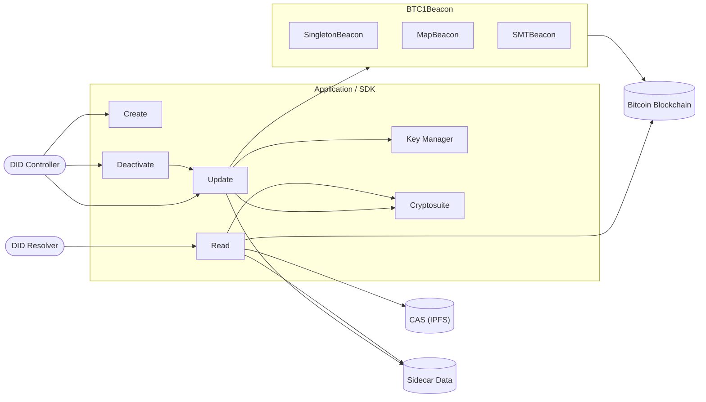
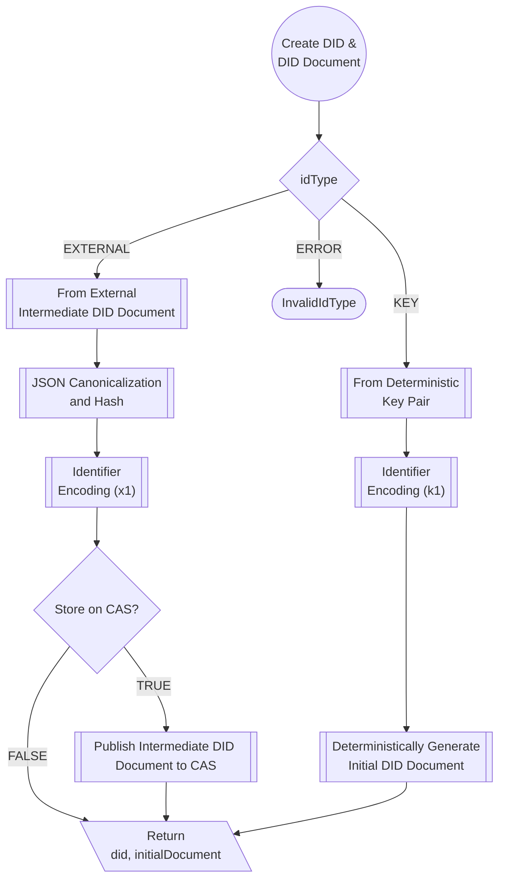
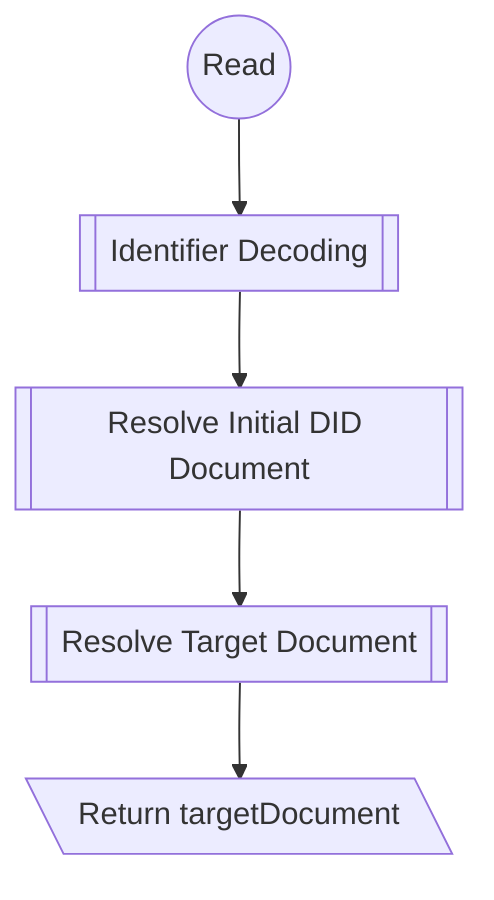
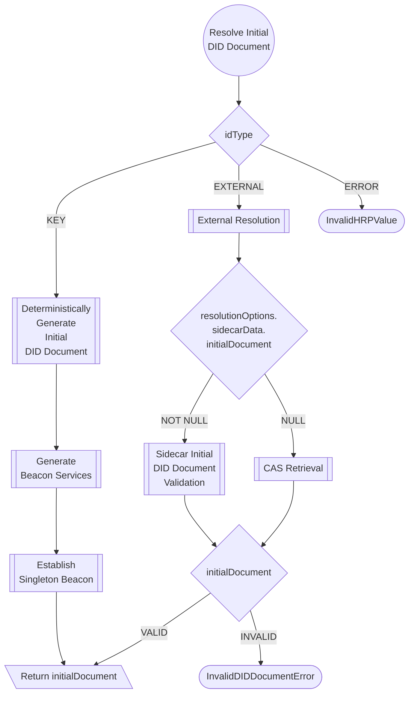
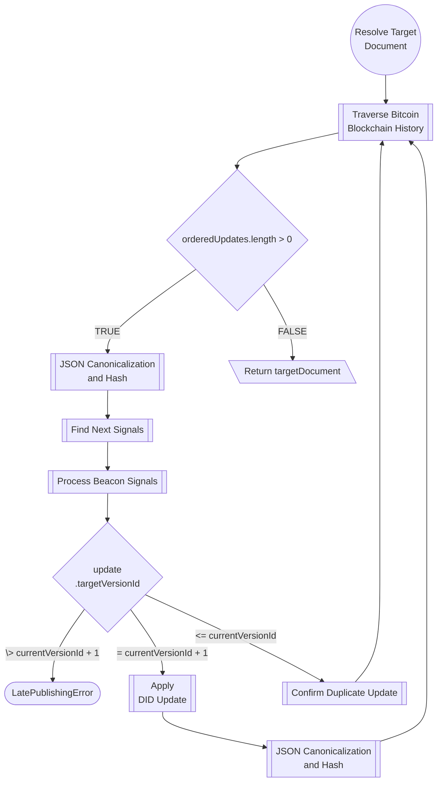
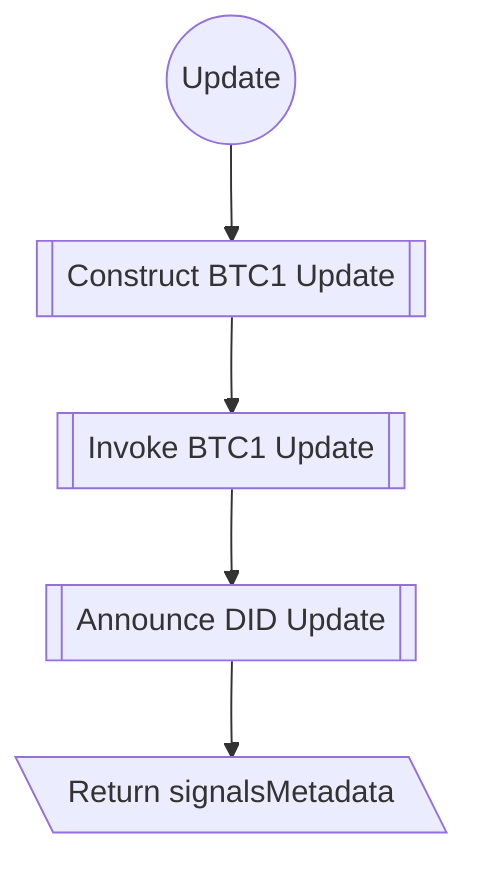
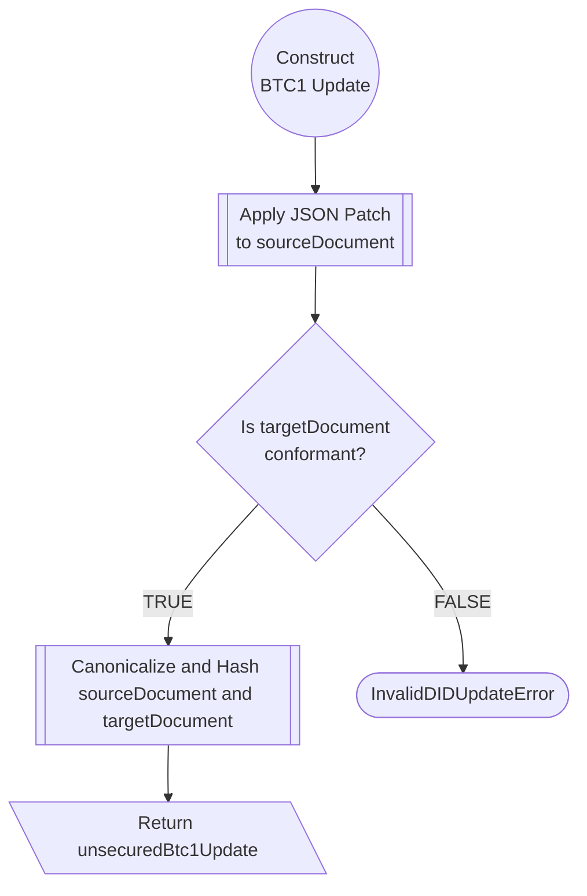
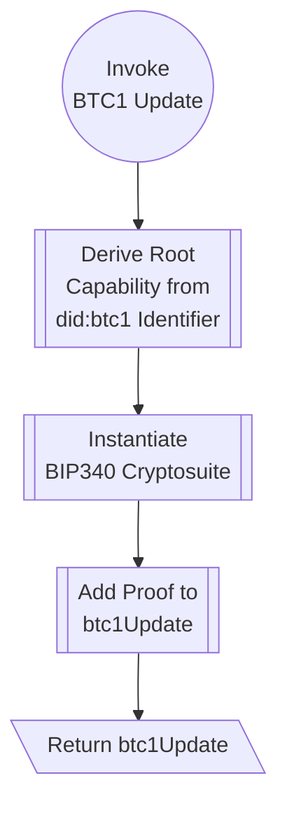
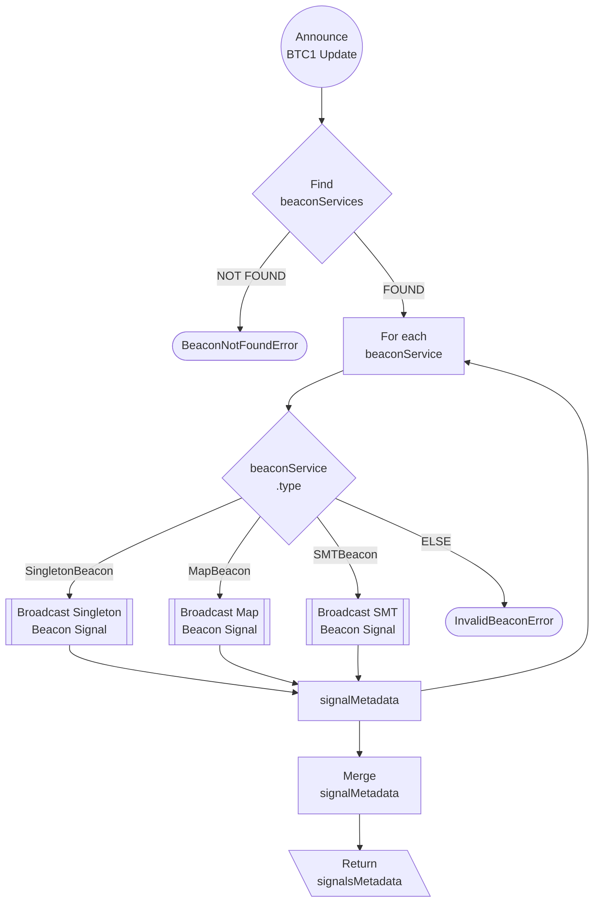

# Diagrams

Below are UML diagrams of the various objects and algorithms in the specification.

## Architecture

The below architecture diagram is a high-level view of the key parts of the specification and their interactions.



## Data Flow

The below data flowcharts map the high-level algorithm calls made for each of the CRUD Operations in the specification.

### Create

The [Create](https://dcdpr.github.io/did-btc1/#create) operation consists of two main algorithms for creating
identifiers and DID documents.

1. [From Deterministic Key Pair](https://dcdpr.github.io/did-btc1/#from-deterministic-key-pair) to encode a secp256k1
   public key as a didbtc1 identifier.
1. [From External Intermediate DID document](https://dcdpr.github.io/did-btc1/#from-external-intermediate-did-document)
   encodes an external [intermediate DID document](https://dcdpr.github.io/did-btc1/#def-intermediate-did-document)
   as a did:btc1 identifier. Doing so allows for more complex [initial DID documents](https://dcdpr.github.io/did-btc1/#def-initial-did-document)
   with features such as the ability to include Service Endpoints and [BTC1 Beacons](https://dcdpr.github.io/did-btc1/#def-btc1-beacon)
   that support aggregation.
   
In both cases, DID creation can be undertaken in an offline manner, i.e., the DID controller does NOT need to interact
with the Bitcoin network to create their DID.



### Read

The [Read](https://dcdpr.github.io/did-btc1/#read) operation is executed by a DID Resolver after receiving a resolution
request for a specific did:btc1 identifier. 

It consists of two main subprocesses:
  1. [Resolve Initial DID Document](https://dcdpr.github.io/did-btc1/#resolve-initial-did-document) to resolve an initial
     DID document for the given did:btc1 identifier.
  1. [Resolve Target Document](https://dcdpr.github.io/did-btc1/#resolve-target-document) to resolve the target document
     using updates found on the Bitcoin blockchain.



#### Resolve Initial DID Document

[Resolve Initial DID Document](https://dcdpr.github.io/did-btc1/#resolve-initial-did-document) is the first subprocess of
the Read operation consisting of two additional subprocesses.

* [Deterministically Generate Initial DID Document](https://dcdpr.github.io/did-btc1/#deterministically-generate-initial-did-document)
  to create an initial DID document from a secp256k1 public key.
* [External Resolution](https://dcdpr.github.io/did-btc1/#external-resolution) to retrieve an intermediate DID document
  either from CAS or Sidecar Data.



#### Resolve Target Document

[Resolve Target Document](https://dcdpr.github.io/did-btc1/#resolve-target-document) is the second subprocess of the Read
operation, which calls a single recursive subprocess, [Traverse Bitcoin Blockchain History](https://dcdpr.github.io/did-btc1/#traverse-bitcoin-blockchain-history),
which walks the Bitcoin blockchain and identifies spending transactions from bitcoin addresses listed in the DID document. These
spends are called Beacon Signals and may contain announcements about changes made to the DID document controlled by the
did:btc1 identifier being resolved.



### Update

The [Update](https://dcdpr.github.io/did-btc1/#update) operation is executed by a DID Controller to make changes to a
DID document. Updates to a DID document is achieved by constructing JSON Patches, invoking and securing them and announcing
them to the Bitcoin blockchain.

It consists of three main subprocesses:
  1. [Construct BTC1 Update](https://dcdpr.github.io/did-btc1/#construct-btc1-update) to construct an unsecured BTC1 update
  1. [Invoke BTC1 Update](https://dcdpr.github.io/did-btc1/#invoke-btc1-update) to add a signature unsecured BTC1 update
  1. [Announce DID Update](https://dcdpr.github.io/did-btc1/#announce-did-update) to broadcast the BTC1 update to the Bitcoin blockchain



#### Contruct BTC1 Update

[Construct BTC1 Update](https://dcdpr.github.io/did-btc1/#construct-btc1-update) is the first subprocess of the Update
algorithm. The goal of this subprocess is to apply a JSON Patch document to a source DID document and verify that the resulting
updated target DID document is a valid, conformant DID document.



#### Invoke BTC1 Update

[Invoke BTC1 Update](https://dcdpr.github.io/did-btc1/#invoke-btc1-update) is section 7.3.2 of the DID BTC1 Method specification.
It is the second subprocess of the Update algorithm with the goal of retrieving and use the private key associated with
the verification method listed in the source DID document to sign and add a Data Integrity Proof to the BTC1 Update.



#### Announce DID Update

[Announce DID Update](https://dcdpr.github.io/did-btc1/#announce-did-update) is the third subprocess of the Update
algorithm. The goal of this subprocess is to retrieve the services object(s) from the source DID document and call
the Broadcast DID Update algorithm corresponding to the type of the BTC1 Beacon: Singleton Beacon, Map Beacon or SMT Beacon.




### Deactivate

The [Deactivate](https://dcdpr.github.io/did-btc1/#deactivate) operation data flowchart is almost identical to the
[Update](#update) flow since the process of deactivation is simply that of creating an update to the DID document.
DID Controllers create a JSON Patch to add the key-value pair `{"deactivated": true}` to the DID document. Below is an
example of a BTC1 Update that would be used to deactivate a DID and DID document.

```json
{
    "updatePayload": {
        "@context": [
            "https://w3id.org/security/v2",
            "https://w3id.org/zcap/v1",
            "https://w3id.org/json-ld-patch/v1"
        ],
        "patch": [
            {
                "op": "add",
                "path": "/deactivated",
                "value": true
            }
        ],
        "targetHash": "ER5jJUisvZafd8n6V2Bo...",
        "targetVersionId": 2,
        "sourceHash": "3osrqR3kJ2YMEDfwcKow...",
        "proof": {
            "cryptosuite": "bip340-jcs-2025",
            "type": "DataIntegrityProof",
            "verificationMethod": "did:btc1:k1xyz123#initialKey",
            "proofPurpose": "capabilityInvocation",
            "capability": "urn:zcap:root:did%3Abtc1%3Ak1xyz123",
            "capabilityAction": "Write",
            "@context": [
                "https://w3id.org/security/v2",
                "https://w3id.org/zcap/v1",
                "https://w3id.org/json-ld-patch/v1"
            ],
            "proofValue": "z3LhCeApi5wirR4jubkKQhEEiVRPZADDamf..."
        }
    }
}
```