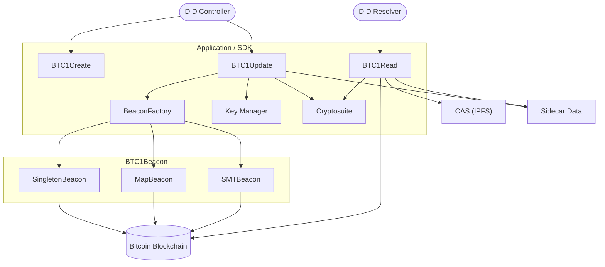
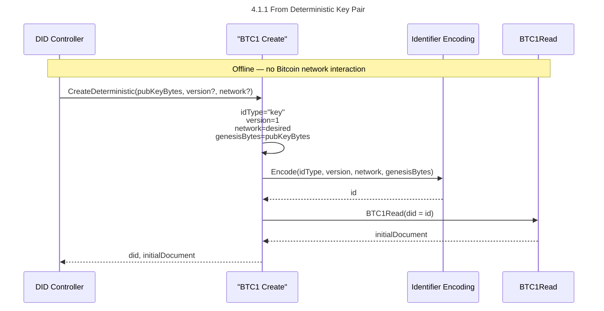
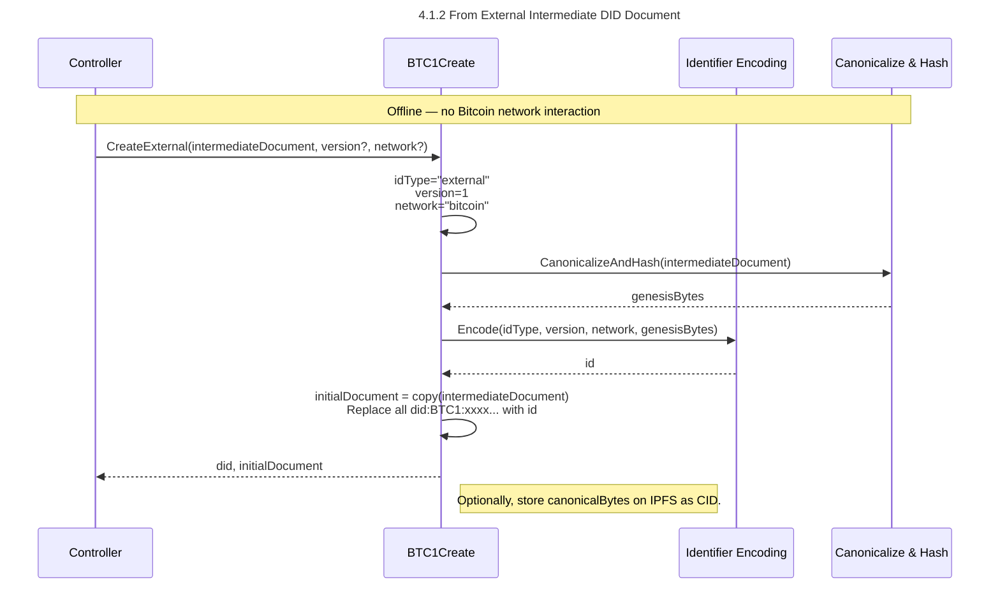

# Diagrams

Below are UML diagrams of the various objects and algorithms in the specification.

## Architecture

The below architecture diagram shows a high-level view of the actors, participants and their interactions as laid out in the specification.

## Sequence

The below sequence diagrams focus on the CRUD algorithms in the specification.

### Create From Deterministic Key Pair

This algorithm encodes a secp256k1 public key as a did:BTC1 identifier. The public key is then used to deterministically generate the initial DID document.

### Create From External Intermediate DID Document

The From Deterministic Key Pair algorithm encodes a secp256k1 public key as a did:BTC1 identifier. The public key is then used to deterministically generate the initial DID document.

